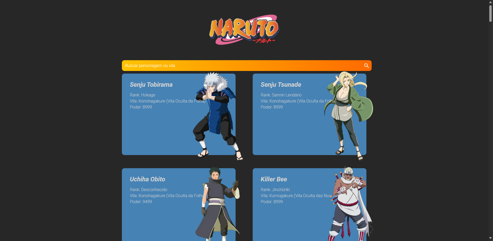
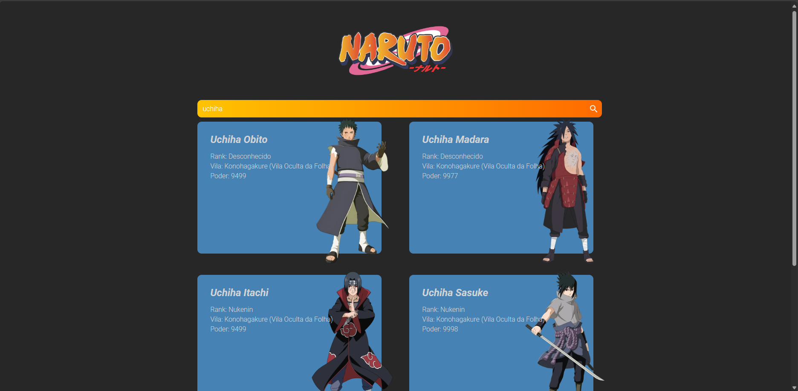
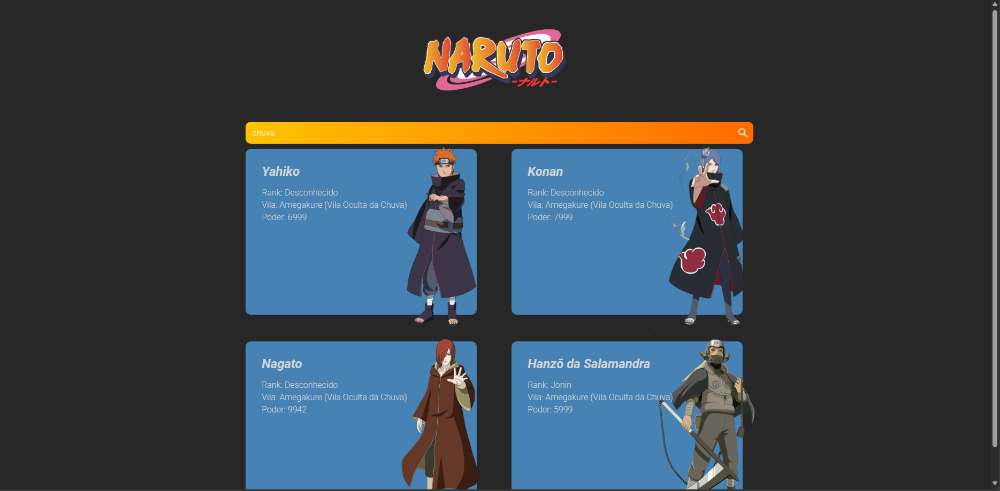
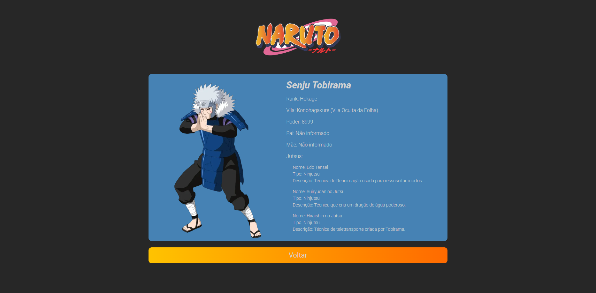

# Naruto Frontend

Esse projeto foi desenvolvido com fins didáticos para estudo do framework Angular no desenvolvimento de frontend

## Projeto
Com o mesmo conceito de projetos de consumo da pokeapi, esse projeto consome a api pública [Naruto BR API](https://naruto-br-api.site/) para resgate, filtros e visualização de personagens do anime Naruto, de acordo com o resultado da API

## Features
- Rotas
- Filtros
- Componentização
- Angular animations
- Estilização com Sass
- Consumo de serviços

## Screenshots
- Todos os personagens

- Filtro por nome

- Filtro por vila

 
- Detalhamento

